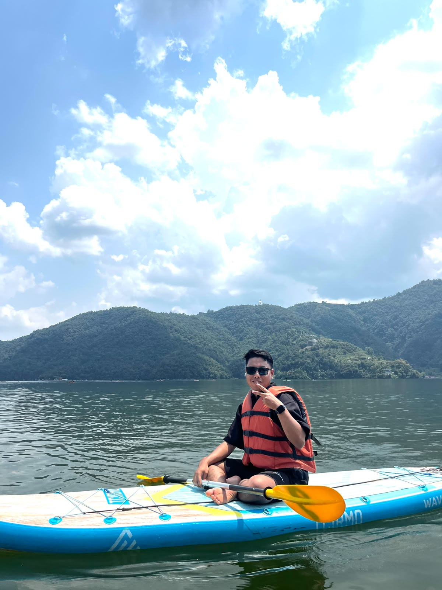

<h1 align="center">Hi 👋, I'm Suprim Shrestha</h1>

<h3 align="center">
MERN Stack Developer building modern, responsive, and practical web applications 🚀
</h3>

  

---

## 👨‍💻 About Me

- 🎓 BSc (Hons) Computer Science graduate
- 🏠 Developed the **AURA Rental Website** as my final-year project
- 🔭 Currently building the **Perfect Tailors Website**
- 🌱 Continuously improving my **MERN Stack** development skills
- 💻 Interested in building responsive and user-friendly web applications
- 🤝 Open to collaborating on exciting web-development projects
- 📫 Reach me at **suprimxtha@gmail.com**
- ⚡ Fun fact: I enjoy transforming ideas into functional web experiences!

---

## 🌐 Connect With Me

---

## 💻 Tech Stack

  

  

---

## 📊 GitHub Stats

  

  

